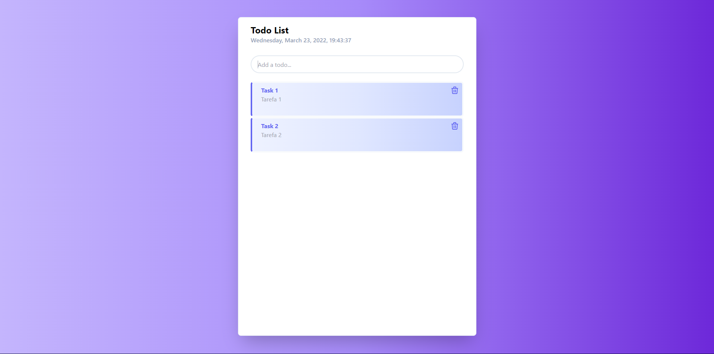
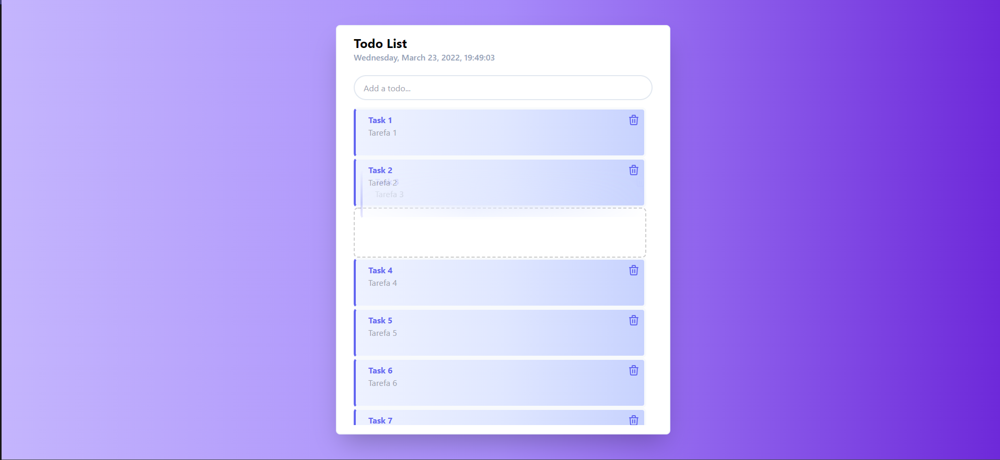
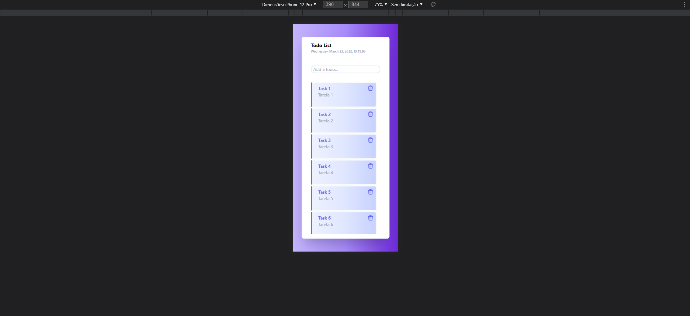

<h1 align="left">
    <a href="https://pt-br.reactjs.org/">🔗 Todo List</a>
</h1>
<p align="left">🚀 Aplicação web desenvolvida utilizando as tecnologias ReactJS (Vite) + Typescript + TailwindCSS para criar e reordernar sua lista de tarefas diárias através do método <i>drag in drop</i>.</p>
<br />

Execução
=================

#### 🧭 Rodando a aplicação web (Frontend)

```bash

# Clone este repositório
$ git clone git@github.com:wallacefreitas/todo_list_vite.git

# Acesse a pasta do projeto no seu terminal/cmd
$ cd todo_list_vite

# Instale as dependências
$ npm install

# Execute a aplicação em modo de desenvolvimento
$ npm run start

# A aplicação será aberta na porta:3000 - acesse http://localhost:3000

```
---

## 🛠 Tecnologias

As seguintes ferramentas foram usadas na construção do projeto:

#### **Website**  ([React](https://reactjs.org/)  +  [TypeScript](https://www.typescriptlang.org/))

-   **[React DnD](https://react-dnd.github.io/react-dnd/about)**
-   **[TailwindCSS](https://tailwindcss.com/docs/guides/create-react-app)**

> Veja o arquivo  [package.json](package.json)

---

## 📷 Screenshots





---

## 📝 Licença

Este projeto esta sobe a licença [MIT](./LICENSE).

Feito por Wallace de Freitas 👋🏽